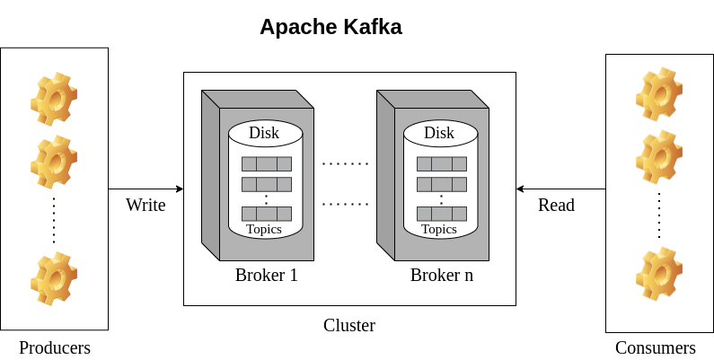
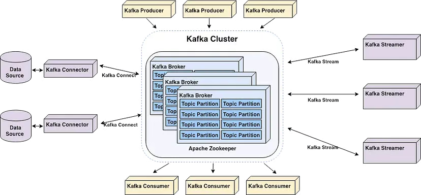

## KAFKA
- **Kafka** is an event streaming platform capturing any event as and when it occurs, storing those events safely in some place so that they can be delivered when some applications ask for it later, or delivering these events for real time processing. By processing, I mean reacting to those events
- **Event** could be anything that happened in our business domain. For example, Sam liked a tweet that could be an event. Sam placed an order that could be an event. User clicked on a link that could be an event. So even could be literally anything. Also known ad Records or messages
- **Topic** is a way of collecting, organizing data in a cluster. You can visualize this like a table in a database or a message queue. We can have hundreds of thousands of topics in a cluster. For example, these could be topics for our application like user-clicks, taxi-location order-events as and when user places an order, we might want to track everything and place those events inside this topic.
- We will not be running one single Kafka instance in real life. We will be running multiple Kafka servers together. We call these brokers Kafka brokers
- **Kafka** keeps everything in binary file
### 🧠 Understanding Kafka Clusters: A High-Level Overview
 ```In real-world applications, we don’t run a single Kafka instance. Instead, we operate multiple Kafka servers working together—these are called Kafka brokers. When these brokers are grouped and configured to work as a unit, they form a Kafka cluster.```

### 🔁 How a Kafka Cluster Works
Think of a Kafka cluster like a team or family—all brokers are aware of each other and work together. Among these brokers, one acts as a manager that coordinates the others. This special broker is called the controller.

### 🧭 What Does the Controller Do?
- Assigns responsibilities to other brokers.
- Manages cluster metadata and health status.
- Handles topic creation and partition leadership assignments.
- If the controller broker fails, Kafka will automatically elect a new controller from the remaining brokers.

### 📦 Topic Creation Example

 #### Let say we want to create a topic named order-event.
 - The controller will ask a broker: Would you like to own the order-event topic and store incoming messages? One broker is then assigned this responsibility and begins storing the data on disk. ```

### 🔄 What Happens If a Broker Fails?
- To ensure data availability and fault tolerance, the controller also assigns replica responsibilities to other brokers:
- These brokers act as backups (replicas).
- As data is written to the primary broker, it is also replicated to these backup brokers.
- If the primary broker fails, one of the replicas can be promoted to leader, and the cluster continues to function seamlessly.

### 🧩 Distribution of Topics 
One broker can manage multiple topics.
A broker may be:
Leader for one topic.
Follower (replica) for another.
Example:

Broker A → Leader for order-event, Follower for taxi-location
Broker B → Leader for taxi-location, Follower for order-event
So, data is evenly distributed, and failover is built-in to handle node failures. 

### 💬 Communication Between Clients and Brokers
Clients (e.g., services) produce and consume events by talking to brokers.

#### Brokers are responsible for:

- Storing topic data.
- Serving data to consumers.
- Receiving data from producers.

### 🧱 Kafka Server Roles
Although we generally refer to all Kafka instances as servers, Kafka assigns specific roles based on their function:

Role	                 Responsibility
Broker	                  Stores topic data, handles client read/write traffic
Controller	              Manages the cluster and broker assignments

In small clusters, a single Kafka server can act as both broker and controller.
In large-scale setups, it's better to separate these roles for scalability.

### 🔁 Kafka Terminology: Leader vs Follower
Kafka uses the Leader–Follower model for data replication and failover:

Term	     Meaning
Leader	      The broker responsible for handling reads and writes for a partition
Follower	  Brokers that replicate the data and can take over if the leader fails

Leadership is per topic partition, not per broker.





### ✅ Summary
Kafka runs as a cluster of brokers.

One broker acts as the controller, assigning tasks and managing metadata.

Data is replicated across brokers using a leader–follower model.

Brokers may serve as both leaders and followers for different topics.

Kafka is designed to be fault-tolerant, allowing safe data production and consumption even during node failures.

If I’m running a Kafka cluster with hundreds or even thousands of machines, how does my application communicate with a specific broker?

# 📘 Understanding Kafka Bootstrap Servers

## 🚀 Stateless vs Stateful Applications

Let’s start by imagining a **stateless application**, such as an **Order Service**.  
In such cases:

- Multiple instances are deployed behind a **load balancer**.
- Incoming requests are distributed across instances.
- Since instances are **stateless**, any instance can handle any request.

✅ **This model works well for stateless applications.**

---

## 🗃️ Kafka is Different — It’s Stateful

Kafka is a **stateful system**.

- In a Kafka cluster with thousands of brokers, **data isn’t stored on every node**.
- Each **topic is divided into partitions**, and partitions are stored on **specific brokers**.
- Each partition has a **leader broker** responsible for reads and writes.

📌 So, if your application needs data from the `order-events` topic, and only **one broker is the leader** for the relevant partition, how does the app know **which broker to contact**?

---

## 🧠 How Kafka Clients Discover Brokers

- Kafka brokers form a **cluster**.
- They all **share metadata** about:
    - Topics
    - Partitions
    - Leaders
    - Other brokers

🔄 Brokers are like a **family** — they know about each other.

---

## 🔌 What is a Bootstrap Server?

A **bootstrap server** is simply **a Kafka broker** that your application connects to **initially**.

> It is **not a special role** — any broker can serve as a bootstrap server.

### When your Kafka client connects to a bootstrap server, it fetches:
- List of all broker addresses
- Topic partition information
- Partition leaders

✅ After this, the client knows **which broker to contact** for any topic/partition.

---

## ❗ What If the Bootstrap Server Is Down?

If your app is configured with **only one** bootstrap server, and it’s down:

- The client **can’t connect**.
- No metadata is fetched.
- The app **fails to communicate** with the cluster.

### ✅ Best Practice:
**Provide multiple bootstrap servers** in your configuration:

```properties
bootstrap.servers=broker1:9092,broker2:9092,broker3:9092
```

Even in a large cluster, just listing **2–3 brokers is sufficient**.

As long as **one is reachable**, the client can discover the rest of the cluster.

---

## 📝 Summary

- Kafka is **stateful**, and data is **partitioned** across brokers.
- Clients don’t need to know all brokers in the cluster.
- They only need to connect to **one or more bootstrap servers**.
- The client fetches cluster metadata and communicates with the right broker.
- Always configure **multiple bootstrap servers** for high availability.

> 🧠 The Kafka client library handles all of this **transparently** — your app just needs a few bootstrap servers to get started.
