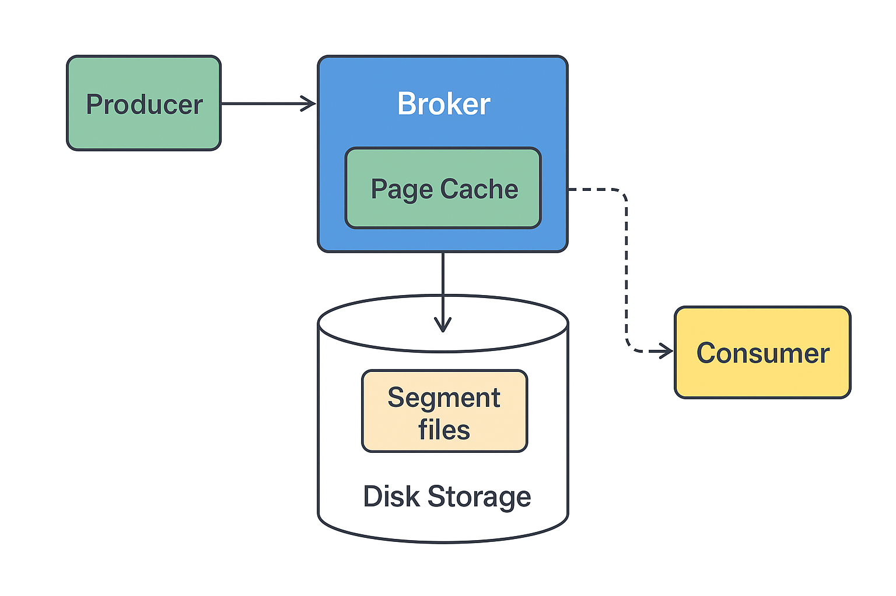

# 📨 Kafka Message Structure

Kafka messages contain several important attributes used for routing, ordering, performance, and observability. Below is a breakdown of these attributes.

---

## ✨ Message Components

| Attribute         | Description                                        | Required | Notes                                        |
|------------------|----------------------------------------------------|----------|----------------------------------------------|
| **Key**           | Used for partitioning                              | No       | If `null`, sticky partitioner is used        |
| **Value**         | The main message payload                           | Yes      | The actual data being transmitted            |
| **Timestamp**     | Event creation or send time                        | No       | Auto-generated unless set manually           |
| **Partition**     | Partition within the topic                         | Yes      | Assigned by key or producer logic            |
| **Offset**        | Message position within the partition              | Yes      | Unique per partition                         |
| **Headers**       | Additional metadata (like tracing info)            | No       | Key-value pairs                              |
| **Compression**   | Compression method used                            | No       | `gzip`, `snappy`, `lz4`, `zstd` supported    |

---

## 🔍 Notes

- When the **key** is null, Kafka uses a **sticky round-robin** to improve performance by batching multiple records to a single partition temporarily.
- **Compression** is beneficial for large payloads but can increase **CPU usage**.
- **Headers** are useful in distributed systems for tracing and context propagation.
- Kafka assigns **timestamps** automatically, but they can be overridden when needed (e.g., for event-time processing).

---

## ✅ Best Practices

- Use meaningful **keys** when message ordering per entity (e.g., user/account) is needed.
- Enable **compression** for high-volume, large messages to reduce disk and network usage.
- Leverage **headers** for adding traceability or service-level metadata.
- Avoid changing the number of partitions mid-stream unless message ordering is non-critical.
---

# 🗄️ Kafka Disk Storage Explained

Yes — **Apache Kafka always stores messages on disk** (persistent storage), even though it often performs as fast as memory.

This document explains how Kafka manages disk storage and why it’s designed that way.

---

## 1️⃣ How Kafka Stores Messages

### 🧾 Log-Based Storage
- Each **topic partition** is an **append-only log file** stored on disk.
- **Messages are written sequentially**, which avoids random disk I/O.

### 📁 Segment Files
- Each partition log is split into **segment files**.
- **Default segment size**: ~1 GB.

### 🧭 Index Files
- Kafka keeps **offset-to-position indexes** both in memory and on disk.
- This enables **quick message lookup** by offset.

---

## 2️⃣ Why Disk Instead of Memory?

### 💾 Durability
- Messages survive **broker restarts or crashes**.

### ⚡ High Throughput
- Sequential disk writes + **OS page cache** = fast performance (even on HDDs, faster on SSDs).

### 📦 Efficient Batching
- Kafka **batches writes** to disk to reduce write overhead.

---

## 3️⃣ Data Flow Overview

```text
Producer → Kafka Broker → OS Page Cache → Disk (Log Segment File)
                                  ↓
                         Replicated to Followers
                                  ↓
                          Consumer reads messages
```




### ✍️ Write Flow
- Messages first go into OS page cache (memory buffer).
- Then appended to disk sequentially in segment files.

### 🔁 Replication
- If enabled, leader sends the message to followers.
- Followers also persist messages to disk.

### 📤 Consumer Read Path
- Often served from page cache (feels in-memory fast).
- If not cached, read directly from disk.

### 4️⃣ Key Kafka Configs for Disk Storage
| Property                      | Description                                                                |
| ----------------------------- | -------------------------------------------------------------------------- |
| `log.dirs`                    | Directories where Kafka stores data.                                       |
| `log.segment.bytes`           | Max size of a log segment before rolling over.                             |
| `log.retention.hours`         | How long Kafka retains data.                                               |
| `log.retention.bytes`         | Max size of retained data per partition.                                   |
| `flush.messages` / `flush.ms` | Control how often Kafka forces data to disk. Usually left to OS to manage. |

### 5️⃣ Important Behavior: Messages Aren’t Deleted on Consumption
- Kafka does not delete messages after they are read.
- Consumers track their offsets in the __consumer_offsets topic.
- Messages stay on disk until retention policies (time or size) delete them.

```
💡 This makes message replay possible — old data can be reprocessed as long as it's still within the retention window.
```
### ✅ Summary
- Kafka uses disk-backed logs for durability and performance.
- Sequential writes + page cache make it nearly as fast as memory.
- Retention and replication give Kafka resilience and flexibility for real-time and batch processing alike.